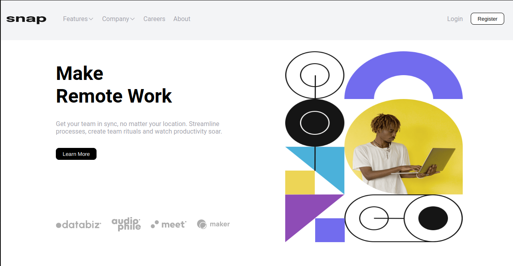
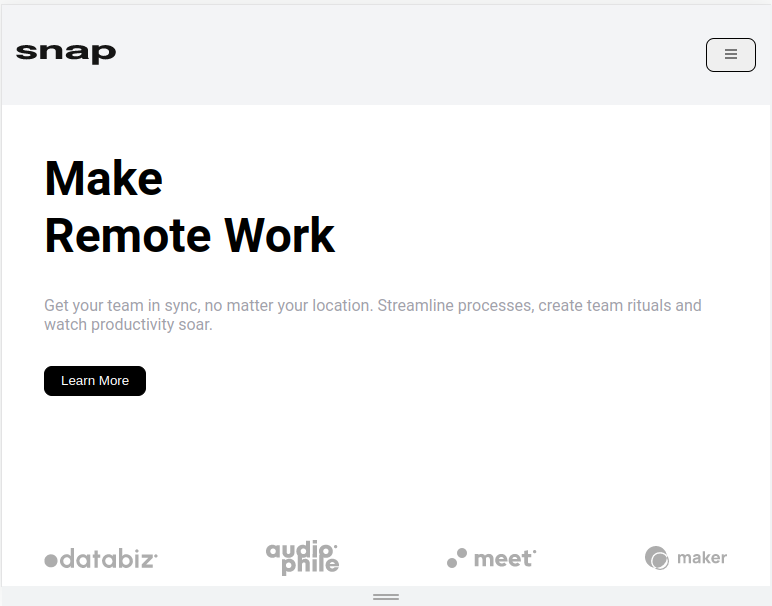

## Projeto Remote-Work 💻
### Desafio **Frontend Mentor**
* https://www.frontendmentor.io/challenges/intro-section-with-dropdown-navigation-ryaPetHE5

### Tecnologias usadas no desenvolvimento:

* ReactJs
* HTML5
* Styled-Components
* Vite

### Principais bibliotecas usadas:

* phosphor-react
* styled-components

### Passo-a-passo para rodar a aplicação:

1. Entre na pasta remote-work;
2. use o comando: ***yarn*** ou ***npm install/i*** para instalar os pacotes;
3. use o comando: ***yarn dev*** ou ***npm run dev*** para rodar a aplicação.